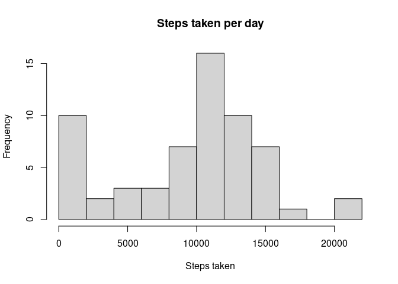

## Loading and preprocessing the data


```r
# loading data
if (!file.exists("activity.csv")) { unzip("activity.zip") }
activity <- read.csv("activity.csv")

# preprocessing data
activity$date <- as.Date(activity$date, "%Y-%m-%d")
```

## What is mean total number of steps taken per day?

Below we calculate the total number of steps taken per day and plot this 
on a histogram.


```r
library(dplyr)
```

```r
daySteps <- activity %>% group_by(date) %>% summarise(totalSteps = sum(steps, na.rm = TRUE))
hist(daySteps$totalSteps, breaks = 10, main = "Steps taken per day", xlab = "Steps taken")
```

<!-- -->

```r
totStepsMean <- mean(daySteps$totalSteps)
totStepsMed <- median(daySteps$totalSteps)
```

The mean and median of the total number of steps taken per day were found to be 9354.2295082
and 10395, respectively.


## What is the average daily activity pattern?

Below the number of steps, averaged across all days, has been plotted against time interval.


```r
meanIntSteps <- activity %>% group_by(interval) %>% summarise(meanSteps = mean(steps, na.rm = TRUE))
plot(meanIntSteps, type = 'l', main = "Daily activity pattern",
     ylab = "Average steps", xlab = "Time interval")
```

<!-- -->

```r
maxInt <- meanIntSteps$interval[which.max(meanIntSteps$meanSteps)]
```

The interval containing the maximum number of steps on average is 835.


## Imputing missing values


```r
missingVals <- sum(is.na(activity$steps))
```

In this dataset there are a total of 2304 missing values. 

Below we produce a corrected dataset that replaces these missing values with the
mean number of steps for the given interval.


```r
correctedActivity <- activity
replacements <- rep(meanIntSteps$meanSteps, length.out = length(activity$steps))
for (i in seq_along(correctedActivity$steps))
{
    if (is.na(correctedActivity$steps[i]))
    {
        correctedActivity$steps[i] <- replacements[i]
    }
}
```

With this corrected dataset we recalculate the total number of steps taken per day
and plot this on a new histogram.


```r
correctedDaySteps <- correctedActivity %>% group_by(date) %>% summarise(totalSteps = sum(steps))
hist(correctedDaySteps$totalSteps, breaks = 10, main = "Steps taken per day", xlab = "Steps taken")
```

<!-- -->


```r
correctedMean <- mean(correctedDaySteps$totalSteps)
correctedMed <- median(correctedDaySteps$totalSteps)
```

The corrected mean and median of the total number of steps taken per day were found to be 1.0766189\times 10^{4}
and 1.0766189\times 10^{4}, respectively. After the replacement of missing data, both these values have 
increased and they are now equal. On the histogram we can see that this is because there are now
much less data points in the 0-2000 steps bin.


## Are there differences in activity patterns between weekdays and weekends?

For the rest of our analysis we have introduced the variable dayType to split the data
into measurements made on weekdays and weekends.


```r
correctedActivity <- mutate(correctedActivity, 
                            dayType = case_when(weekdays(date) %in% c("Saturday","Sunday") ~ "weekend", 
                                                TRUE ~ "weekday"))
```

The number of steps, averaged over all days, for a given interval can be seen plotted below.
This time the data has been split into weekdays and weekends.


```r
correctedMeanIntSteps <- correctedActivity %>% group_by(interval, dayType) %>% summarise(meanSteps = mean(steps))

library(lattice)
xyplot(meanSteps ~ interval | dayType, data = correctedMeanIntSteps, type = "l", layout = c(1, 2),
       xlab = "Interval", ylab = "Number of steps")
```

<!-- -->

This plot suggests an earlier and more active start to the day on weekdays but more sustained 
activity throughout the day on weekends.
